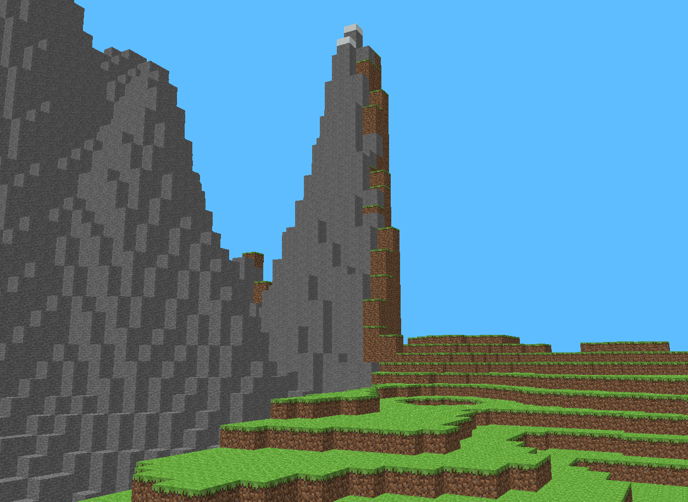
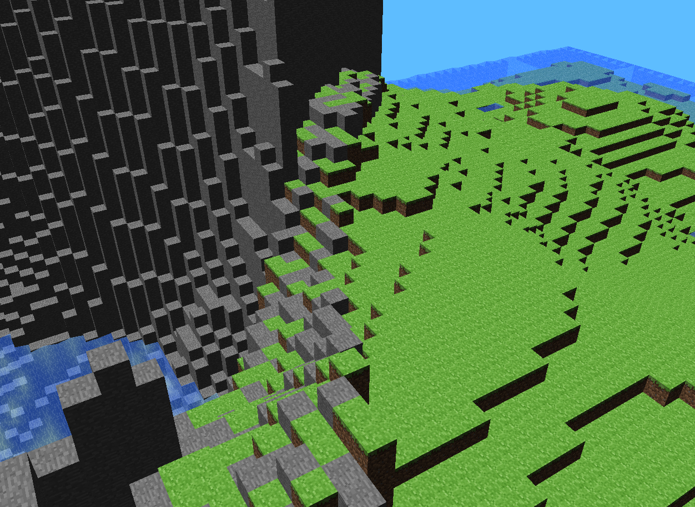
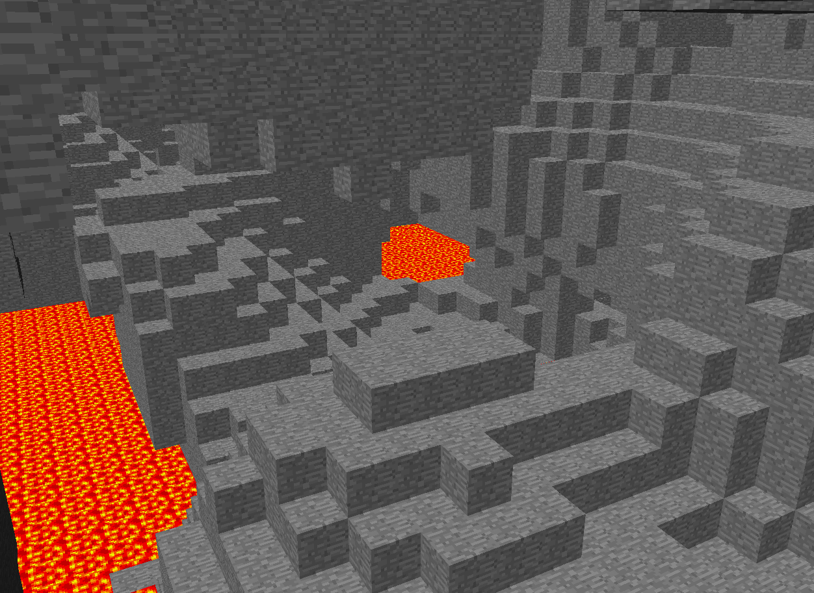
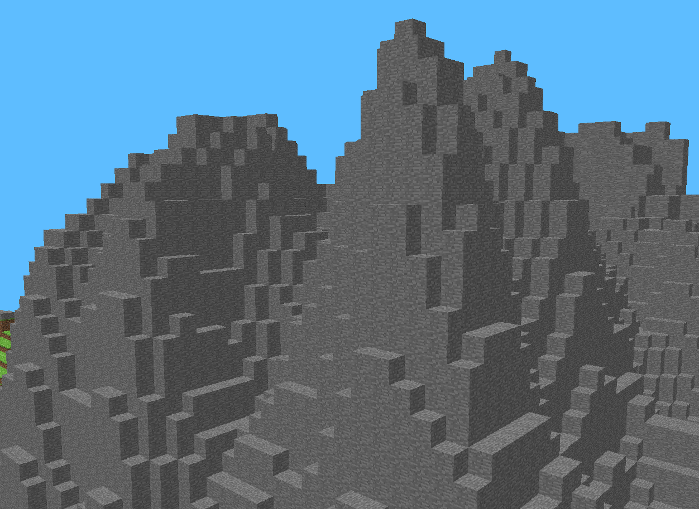
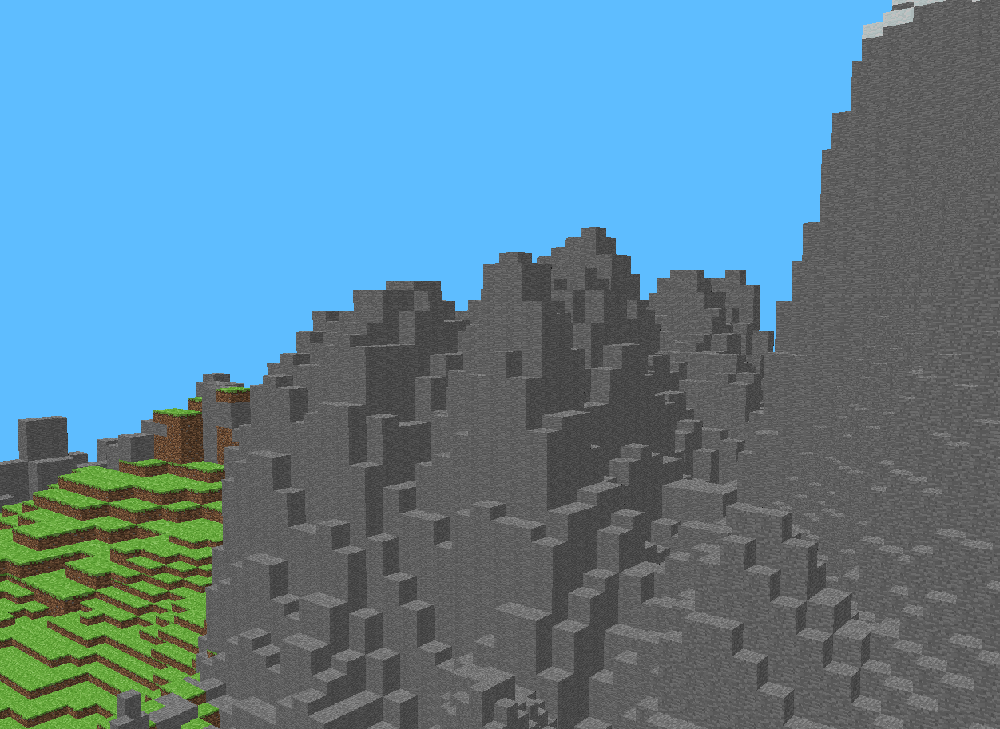
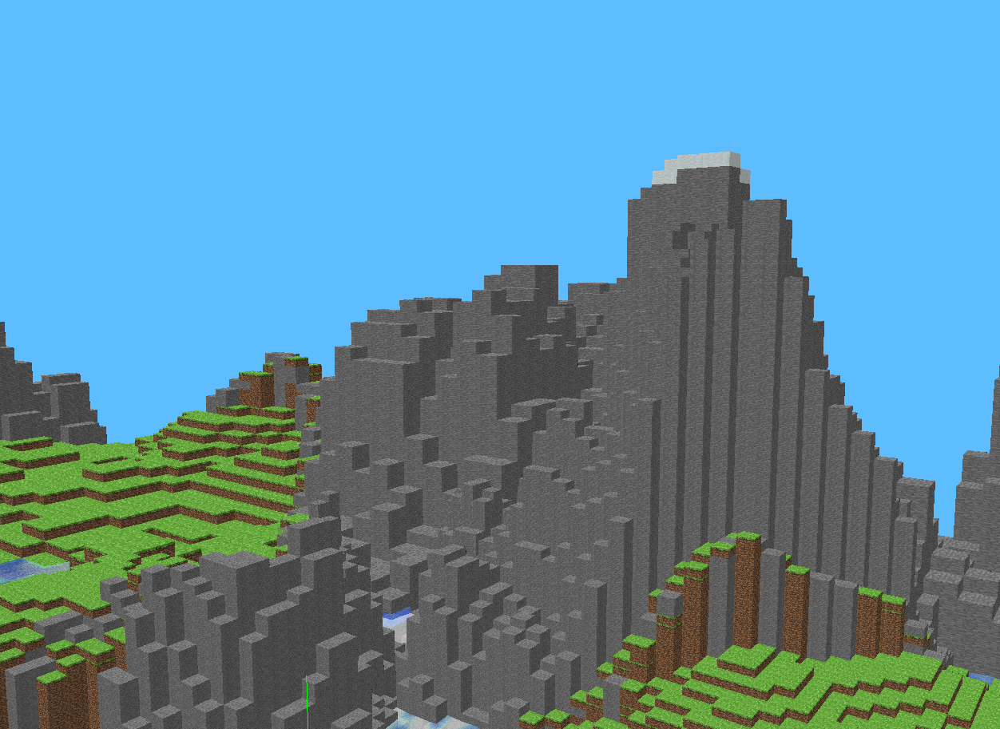

# Mini-Minecraft (Qt + OpenGL)

This is a procedural voxel world written in C++ with Qt and modern OpenGL. It started from the classic “render cubes in a flat world” baseline and grew into a streaming sandbox with biomes, caves, rivers, liquids, post-processing, multithreaded chunk generation, and a saveable world loop.

This project is primarily about systems like world streaming, data structures, multithreading, graphics pipeline design, and the tooling glue to make it usable across environments, not about shipping a content-complete game.

<sub>*Tested on: AMD Ryzen 7 3700X, 32GB RAM, AMD Radeon RX 5700 XT on Ubuntu 22.04 container via XWayland.*</sub>


<br>

## What This Project Is

Mini-Minecraft is a real-time renderer and simulation loop for a chunked voxel world. The focus is on generating and streaming a large world without stalling the frame, keeping GPU memory under control, and layering “game-feel” features (post processing, audio, interaction) on top of a clean rendering core.

It is not a full Minecraft clone. There is no inventory/crafting, no AI mobs, no lighting propagation system, and no full material system. Those are deliberate omissions: I focused on building the foundation you would need before those features make sense.

## Quick Start (devcontainer)

Build from the repo root:
```sh
./build.sh
```

Run under XWayland (recommended on Wayland hosts because it restores classic FPS-style mouse capture behavior via X11):
```sh
./run-xwayland.sh
```

Wayland-native run is also available, but pointer locking is intentionally restricted in Wayland and this project currently uses the “warp-to-center” camera technique that maps cleanly to X11/XWayland:
```sh
./run-wayland.sh
```

If XWayland cannot connect to the display from inside a container, you may need to grant the container user access on the host (X11 auth model). On the host:
```sh
xhost +si:localuser:$USER
```

## Controls (default)

The mouse controls camera yaw/pitch. Movement is WASD-style with a flight toggle for fast exploration.

| Action | Input |
| --- | --- |
| Look | Mouse |
| Move | W/A/S/D |
| Toggle flight mode | F |
| Ascend/Descend (flight) | E / Q |
| Jump / swim up | Space |
| Delete block | Left click |
| Place block | Right click |
| Quit | Esc |

## Procedural World Generation

The world is generated in chunks (16×256×16 blocks) and grouped into zones (64×64 in X/Z). That structure is the backbone for performance, streaming, and persistence.

### Biomes, Heightfields, and Material Layers

Surface height comes from seeded Perlin-style noise and fractal octave composition. Instead of having a single height function for the entire world, biome selection is a dedicated step that drives which height function is used. Grassland and mountain biomes share a common “floor” level, but mountains get a higher amplitude and different frequency, producing silhouettes that read as distinct at a distance.

Biome transitions are handled explicitly. Rather than snapping from one biome to another at a hard threshold, the code identifies transition regions and blends the two height functions. This avoids sharp seams and makes biome borders feel more natural.


<br>

Implementation notes:

Biome selection and height synthesis live in `assignment_package/src/scene/biomenoise.cpp`. The implementation uses a seeded permutation to produce deterministic results; changing the seed changes the world, while keeping the seed produces repeatable terrain (important for save/load that stores only deltas).

### Caves (3D Noise) and Lava Pockets

Once the heightfield establishes the surface, the interior isn’t simply filled solid. A 3D noise function is evaluated in a band of underground Y values to carve caves. The cave rules intentionally produce “air” pockets but also introduce lava at lower depths to create visually distinctive underground spaces and to make spelunking feel different from surface traversal.


<br>

Implementation notes:

Chunk block generation is performed in `assignment_package/src/scene/chunk.cpp` (`Chunk::generate` and `Chunk::getGeneratedBlockAt`). The cave test uses `BiomeNoise::perlin3D` and gates the carve-out to a vertical interval so that caves stay underground rather than swiss-cheesing the entire world.

### Rivers (L-system / Turtle Interpretation)

Rivers are generated as zone-level features using an L-system. This is a deliberate choice: it gives a controllable “branching structure” that reads as rivers from a distance, and it demonstrates a very different procedural approach compared to noise. The L-system string is interpreted using a turtle state (position + heading) and the resulting 2D path is rasterized into a set of river coordinates. Chunk generation then consults this set and carves out a riverbed + water volume.

Implementation notes:

The L-system lives in `assignment_package/src/scene/rivers.cpp`. The generated positions are stored in a hash set for O(1)-ish lookups in the hot path of block generation. Chunk generation checks `Rivers::isRiverAt` and applies a small river depth model, producing a riverbed and a water layer.

## Streaming, LOD, and “Don’t Stall the Frame”

Rendering voxels naively tends to fail in two ways: you either generate too much geometry and drown the GPU, or you regenerate geometry on the main thread and stall the frame.

This project attacks the problem from multiple angles: chunked data structures, dynamic level-of-detail, view frustum culling, and multithreaded work scheduling.

### Chunk LOD (Distance-Based)

Each chunk has a level-of-detail value that controls how much geometric detail is built. Close chunks build fine-grained geometry; far chunks build coarser geometry. The important detail is that LOD is not purely a render switch: changing LOD invalidates geometry and triggers a rebuild, which means it must be coordinated carefully with asynchronous workers.

| LOD 0 | LOD 1 | LOD 2 |
| --- | --- | --- |
|  |  |  |
Implementation notes:

LOD selection happens in `assignment_package/src/scene/terrain.cpp` inside `Terrain::draw`. Distance thresholds determine the LOD level, and the chunk updates itself via `Chunk::setLevelOfDetail`. The chunk’s meshing logic uses the LOD to adjust sampling density when building VBO data.

If you already have three images showing LOD levels: put them in `docs/img/lod_0.png`, `docs/img/lod_1.png`, `docs/img/lod_2.png` and embed them here as a side-by-side comparison.

### Meshing, Face Culling, and a Texture Atlas

A voxel engine lives or dies by its meshing strategy. This project does not brute-force triangles for every block; it generates geometry per chunk by emitting faces only where a block is exposed to air (or where a liquid needs a surface). Opaque and transparent geometry are built into separate buffers so that blending can be handled in a controlled pass.

LOD ties directly into meshing. When a chunk is far away, blocks are grouped into larger “macro blocks” by sampling an area and selecting the predominant block type. Geometry is then emitted for the macro block, with face checks performed against neighboring macro blocks. Neighboring chunks may be at different LODs, so the face generation includes a pragmatic rule: when adjacent chunks disagree on LOD, the engine errs on the side of drawing extra faces instead of risking cracks or expensive edge-case logic. The result is stable visuals and simpler mental overhead, with a modest geometry cost that is mostly paid only in the distance.

Texturing uses a classic texture atlas. Face UVs are assigned based on block type and face direction (e.g., grass top vs side). This keeps draw calls low and makes it easy to extend the material palette by adding new atlas tiles without changing the shader interface.

Implementation notes:

Chunk meshing is implemented in `assignment_package/src/scene/chunk.cpp` (`Chunk::createVBOdata`, `Chunk::shouldRenderFace`, and `Chunk::generateBlockGeometry`). Texture atlas UV mapping is handled in `Chunk::addUV` and `Chunk::addUVHelper`.

### Frustum Culling

Even with LOD, you don’t want to submit chunks that are behind the camera or outside the view volume. Each chunk can determine whether it’s in the camera frustum and skip both buffering and drawing when it isn’t. This is a cheap test that saves a surprising amount of work in practice—especially when you’re near terrain features like mountains where many chunks exist but are occluded by view direction.

Implementation notes:

The culling hook is invoked from `Terrain::draw` via `chunk->isInView(camera)` (see `assignment_package/src/scene/terrain.cpp`).

### Multithreaded Generation and VBO Building

World generation is split into two heavy phases: block data generation (procedural rules) and mesh/VBO generation (geometry extraction). Both phases are pushed off the main thread using `QThreadPool` workers. The main thread remains responsible for OpenGL calls, but it can “pull” completed CPU-side geometry and upload it when ready.

Implementation notes:

Block generation uses `BlockTypeWorker` (`assignment_package/src/scene/blocktypeworker.cpp`) and VBO generation uses `VBOWorker` (`assignment_package/src/scene/vboworker.cpp`). Chunks expose flags such as `needsUpdate`, `hasBlockData`, `hasVBOData`, and `hasGPUData` to coordinate safe handoff between threads and the render loop.

### GPU Memory Hygiene

An easy trap in voxel projects is to keep every far-away chunk’s GPU buffers forever. Here, chunks beyond a maximum view distance have their VBOs destroyed to reclaim GPU memory. The chunk can still exist in CPU memory and can be regenerated later, but the GPU doesn’t pay for what the player can’t see.

Implementation notes:

See the “chunksToDestroy” logic in `Terrain::draw` (`assignment_package/src/scene/terrain.cpp`) which calls `chunk->destroyVBOdata()` on far chunks and clears GPU-ready state.

## Rendering and Post-Processing

The renderer is built around a straightforward but extensible pipeline: render the world into an offscreen framebuffer, then apply a post-process pass as a full-screen quad. This unlocks effects that are awkward (or impossible) to do cleanly in the forward pass.

### Water/Lava Rendering and Under-Fluid Effects

Water and lava are rendered in a transparent pass, including a water-wave shader for surface motion. When the player’s camera is submerged, the final image is post-processed to apply a themed tint/effect—underwater vs under-lava—rather than relying only on fog or a single global color shift.

Implementation notes:

Shader setup is in `assignment_package/src/mygl.cpp` (`initializeGL`), and the post-process selection is in `MyGL::paintGL` based on the player’s `underLiquidBlock` state (see `assignment_package/src/scene/player.cpp`). The pipeline uses a framebuffer (`assignment_package/src/framebuffer.cpp`) and draws a quad in `MyGL::renderPostProcess`.

Suggested README images:

Show a three-frame sequence: above water → half-submerged → fully submerged. Then repeat for lava. These are the kinds of “small touches” that immediately tell an experienced reviewer that the renderer is more than a cube demo.

### Transparency Done Deliberately

Transparent geometry is notoriously easy to “kind of” render while still being wrong. Here, liquid geometry is separated from opaque geometry at the chunk level, and drawn in a dedicated pass. The renderer also draws the transparent pass twice with different culling modes. This helps with the common artifact where only one side of a water surface is visible depending on view direction, and it makes water volumes read correctly when you can see both front- and back-facing surfaces.

Implementation notes:

Chunk geometry splits opaque vs transparent VBOs in `Chunk::createVBOdata`, and the rendering order is orchestrated in `Terrain::draw` (`assignment_package/src/scene/terrain.cpp`) using `glCullFace(GL_BACK)` and `glCullFace(GL_FRONT)` for the liquid pass.

## Persistence: Saving and Loading Terrain Deltas

Saving voxel worlds is deceptively expensive if you serialize entire chunks. This project takes a pragmatic approach: the procedural generator defines the baseline world, and save files store only **modified blocks** (deltas). Zones are saved/loaded asynchronously, and zone files are grouped into region folders to keep filesystem operations manageable.

Implementation notes:

Terrain save/load orchestration is in `assignment_package/src/scene/terrain.cpp` (`saveZone`, `loadZone`, and `saveTerrain`). Chunks compare generated blocks to current blocks and serialize only the differences in `Chunk::serializeModifiedBlocks` (see `assignment_package/src/scene/chunk.cpp`). Save/load jobs are executed through a worker (`assignment_package/src/scene/saveloadworker.cpp`) using `QThreadPool`.

## Interaction, Physics, and Audio

The player controller supports a flight mode for fast exploration and a grounded mode with gravity, jumping, and collision. Movement also reacts to fluids: swimming changes acceleration/drag and triggers different audio. In addition to ambience, there are step sounds that depend on the surface block type, which makes traversal feel grounded in the terrain’s material system.

Implementation notes:

Player physics and collision logic live in `assignment_package/src/scene/player.cpp`. Audio uses `QSoundEffect` in `assignment_package/src/mygl.cpp` with looped and one-shot sounds, and step sounds are switched based on `onTopOf` block type.

## Future Work

If I continued iterating on this project, the next steps would mostly focus on portability, rendering quality, and deeper engine architecture.

The biggest practical improvement would be moving to a **Qt6 + Wayland-first** approach and implementing proper pointer constraints/relative motion so that camera control works without relying on XWayland behavior. The “right” long-term direction is to embrace the platform rather than fighting it.

Another major direction would be migrating the renderer to a modern abstraction such as **Dawn/WebGPU**. That would trade some raw control for portability and long-term API stability, and it would make it easier to target platforms that do not expose the exact OpenGL version/behavior expected here.

Finally, there’s plenty of room for visual upgrades: better water rendering (depth-based absorption, screen-space reflections), atmospheric scattering, shadow mapping, and a real lighting model for the world.

## Project Layout

The important bits are in `assignment_package/src`. Assets are in `textures/` and `sounds/`. Build/run helpers live at the repo root.

## Credits / Notes

This repo includes a vendored copy of GLM headers under `assignment_package/include/glm/`.

Some audio clips and block texture assets are derived from Minecraft and are used here for educational/demo purposes.
